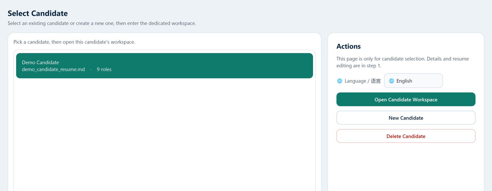
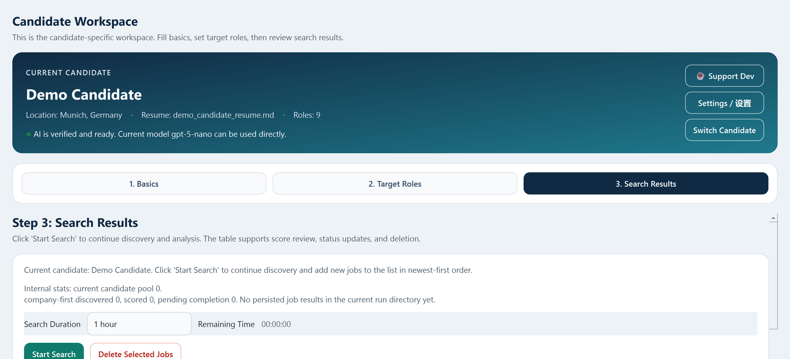
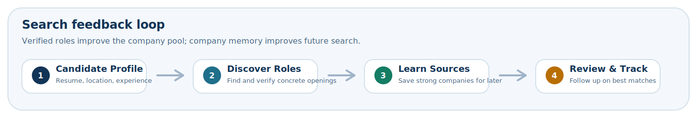

# Job Hunter

> 面向有经验求职者的本地优先岗位发现工作台。核心思路是：先找对公司，再找对岗位。  
> A local-first job discovery workspace for experienced professionals. The core idea is simple: find the right companies before chasing the right roles.
>
> 本 README 先给中文，再给英文。普通用户请直接看 Windows 下载部分；开发者和协作者再看源码说明。  
> This README starts with Chinese and ends with English. End users should go straight to the Windows download section; developers and collaborators can use the source instructions.

## Product Preview / 产品预览

### Candidate Entry / 候选人入口



### Search Workspace / 搜索工作台



### Company-first Workflow / 公司优先流程



## 中文说明

### 项目定位

Job Hunter 不是一个面向大众求职场景的职位推荐器。它更适合已经工作一段时间、拥有明确专业技能和职业方向的求职者：先从你的经验、目标方向和地域偏好出发，识别更值得跟踪的公司，再持续发现这些公司公开放出的岗位。

很多通用求职平台更擅长把热门职位推给大量用户，但对系统工程、验证测试、MBSE、可靠性、数字孪生、能源装备等细分方向来说，岗位名称、组织结构和招聘表达往往并不标准化。真正匹配的机会，经常藏在“公司需要这类能力，但岗位标题不完全一样”的场景里。

这个项目的核心思路是：先理解候选人已有的经验和可迁移能力，再推导哪些公司更可能需要这些能力，然后优先抓取公司官网、ATS 和有限的 Web 信号，最后把岗位匹配、状态维护和后续行动集中到一个本地工作台里。

一句话总结：**先找对公司，再找对岗位。**

### 适合谁

- 已经工作一段时间、具备明确专业能力的中高级求职者
- 细分行业或专业岗位人群，如系统工程、验证测试、MBSE、数字孪生、可靠性、能源装备等方向
- 希望跨行业迁移，但不想丢掉核心能力的人
- 不满足于“职位平台推荐流”，更希望主动建立目标公司池的人

### 你应该从哪里开始

如果你只是想直接使用软件，请先看“普通用户”路径；如果你要改代码、排查问题或参与协作，再看“开发者”路径。

#### 普通用户：直接下载 Windows 版本

如果你不是开发者，只是想直接使用软件，请不要从源码开始，也不需要在本地安装 Python。你应该直接去 GitHub Releases 下载 Windows 发布包。

- 最新发布页：
  [https://github.com/liuyingxuvka/Job-Hunter/releases/latest](https://github.com/liuyingxuvka/Job-Hunter/releases/latest)
- 所有发布版本：
  [https://github.com/liuyingxuvka/Job-Hunter/releases](https://github.com/liuyingxuvka/Job-Hunter/releases)
- 应下载的文件：
  `Job-Hunter-<version>-win64.zip`

推荐步骤：

1. 打开上面的 `latest release` 链接。
2. 下载 `Job-Hunter-<version>-win64.zip`。
3. 解压到一个普通文件夹，不要直接在 zip 压缩包里运行。
4. 双击 `Jobflow Desktop.exe`。
5. 如果 Windows 对直接启动 `.exe` 比较严格，再改用 `START_JOBFLOW_DESKTOP.cmd`。
6. 第一次打开后，在应用里填写 API 设置即可开始使用。

这个发布包已经包含桌面运行时、demo 候选人种子和安全模板。普通用户本地不需要额外安装 Python。

发布包不会包含真实候选人数据库、客户数据、搜索历史、导出结果或运行备份。

#### 开发者：从源码运行

下面这部分只面向开发者和协作者。

开发环境要求：

- Windows 开发环境优先
- Python 3.10+
- OpenAI API Key

从 GitHub Release 下载的 Windows 发布包不要求本地单独安装 Python。

可用环境变量：

- `OPENAI_API_KEY`
- `OPENAI_BASE_URL`
- `JOBFLOW_OPENAI_MODEL`
- `AZURE_OPENAI_API_KEY`
- `AZURE_OPENAI_ENDPOINT`
- `AZURE_OPENAI_DEPLOYMENT`
- `JOBFLOW_PYTHON_PATH`

源码启动方式 A：从仓库根目录快速启动

在仓库根目录双击：

```bat
START_JOBFLOW_DESKTOP.cmd
```

这个入口会调用 `desktop_app/run_release.ps1`，自动寻找本地 Python，并启动桌面应用。

源码启动方式 B：在 `desktop_app/` 下以开发模式运行

```powershell
cd .\desktop_app
python -m venv .venv
.\.venv\Scripts\python -m pip install -U pip
.\.venv\Scripts\python -m pip install -e .
.\.venv\Scripts\jobflow-desktop
```

如果你是在做 CLI、自动化或 AI 集成，请直接阅读：

- [AI Agent Discovery (English)](docs/AI_AGENT_DISCOVERY.md)
- [AI Integration Notes](docs/AI_INTEGRATION.md)

这些内容保留在单独文档里，不放在 GitHub 首页 README 展开。

### 当前仓库能做什么

当前仓库主要包含一个正在持续迭代的本地桌面工作台，以及一套 Python 原生的公司优先搜索执行链路。

已落地能力包括：

- 本地候选人管理：维护姓名、邮箱、当前所在地、目标地区、备注和简历路径
- AI 目标岗位设立：辅助生成更具体的岗位方向，并维护中英文岗位名称和说明
- 本地 AI 设置：支持直接填写 API Key 或绑定环境变量，并验证模型可用性
- 公司优先的岗位发现流程：根据候选人的岗位方向和偏好，由 Python 搜索主线完成公司发现、公司筛选与岗位抓取
- 搜索结果工作台：查看匹配结果，并维护关注、投递、Offer、放弃等状态
- 本地优先数据存储：以 SQLite 作为候选人、搜索配置、结果状态和运行数据的主存储；`desktop_app/runtime/search_runs/` 只保留按候选人划分的临时工作目录

### 核心流程

1. 创建候选人档案，导入简历，填写当前所在地、目标地区和补充说明。
2. 通过 AI 推荐或手动补充方式，建立真正值得追踪的目标岗位方向。
3. 基于这些岗位方向生成搜索上下文，优先发现相关公司，再抓取公司官网或 ATS 的公开职位。
4. 对岗位进行匹配分析和结果整理，在工作台里持续维护关注、投递和反馈状态。

### 仓库结构

| Path | 说明 |
| --- | --- |
| `desktop_app/` | 新版桌面应用，负责候选人工作台、AI 设置、搜索结果查看与后续维护 |
| `docs/` | GitHub 说明文档，包括产品定位、架构和路线图 |
| `README_RELEASE.txt` | 面向打包发布目录的简要启动说明 |
| `START_JOBFLOW_DESKTOP.cmd` | Windows 下的快速启动入口 |

### 当前边界

这个项目目前更接近一个“发现 + 筛选 + 管理”的本地工作台，而不是一个“全自动找工作/自动投递平台”。

当前明确不应过度承诺的内容：

- 不是面向所有求职者的大众化职位推荐产品
- 不是自动投递系统
- 不是已经完成商业化打磨的成品桌面软件
- 不是已经为所有平台和长期维护场景都做完最终工程化定型的产品

### 公开仓库边界

这个仓库公开部分只保留源码、文档、演示种子和安全示例模板；个人简历、公司池、搜索结果、SQLite 数据和运行备份必须留在本地。

当前已经把这套边界写进 `.gitignore`、`scripts/privacy_audit.ps1` 和 GitHub Actions，所以未来同事协作时也会按同一规则执行。

### 文档导航

- [更新记录](CHANGELOG.md)
- [产品定位](docs/PRODUCT_POSITIONING.md)
- [架构概览](docs/ARCHITECTURE.md)
- [llms.txt](llms.txt)
- [AI agent 检索说明（English）](docs/AI_AGENT_DISCOVERY.md)
- [自动化与 AI 集成说明](docs/AI_INTEGRATION.md)
- [路线图](docs/ROADMAP.md)
- [仓库边界](docs/REPOSITORY_BOUNDARY.md)
- [GitHub 仓库设置建议](docs/GITHUB_REPO_SETUP.md)
- [贡献说明](CONTRIBUTING.md)

### 贡献与讨论

这个项目欢迎的不只是代码提交，也欢迎思路、实验方向和产品判断。我们尤其欢迎围绕“专业型人才如何更高效找到更匹配职位”这个问题展开合作。

欢迎贡献的方向包括：

- README、文档和 GitHub 展示信息的改进
- 新的 AI 功能，例如岗位方向生成、匹配解释、排序理由、候选公司摘要、工作流自动化
- 新的搜索引擎或数据源接入，例如更多 ATS、官网抓取方式、行业特定来源或地区性来源
- 更好的匹配逻辑、评分策略、候选公司发现方法和搜索启发式
- 职业发现方法、跨行业迁移策略，以及如何先找到更匹配公司的思路
- 更好的结果管理、审核状态、导出和工作流体验
- 新的产品想法、研究问题、评估方法、数据集和用户访谈结论

如果 GitHub Discussions 还没有启用，也欢迎直接开 Issue 来讨论想法。你可以把问题写成功能提案、研究假设、数据源建议，或者“为什么某类专业人才很难被现有平台正确匹配”的分析。

提 Issue 或 PR 前，建议先阅读 [CONTRIBUTING.md](CONTRIBUTING.md)。

## English

### Project Positioning

Job Hunter is not a generic job recommendation tool for mass-market job search. It is designed for professionals with real domain experience: start from your existing skills, career direction, and location preferences, identify companies that are more likely to need that expertise, and then discover open roles worth tracking.

Mainstream job platforms are often optimized for broad job discovery and high-volume recommendations. In specialized fields such as systems engineering, V&V, MBSE, reliability, digital twin, or energy equipment, job titles and hiring language are often inconsistent. Better opportunities are often hidden in companies that need the capability even when the role title does not match the resume exactly.

The core idea is simple: understand the candidate's experience and transferable skills first, infer which companies are likely to value those skills, search company career pages and ATS sources before broad job boards, and then manage matching, review state, and follow-up actions in one local workspace.

In one sentence: **find the right companies before chasing the right roles.**

### Who It's For

- Experienced candidates with clear professional skills and domain depth
- Specialists in areas such as systems engineering, validation and verification, MBSE, digital twin, reliability, or energy equipment
- People who want to move into adjacent industries without abandoning their core strengths
- People who prefer building a focused target-company pipeline instead of relying on generic platform feeds

### Where To Start

If you only want to use the app, follow the end-user path first. If you want to modify code, debug behavior, or collaborate on development, use the developer path below.

#### End Users: Download The Windows Build

If you are not a developer and just want to use the app, do not start from the source code and do not install Python locally. Go straight to GitHub Releases and download the Windows build.

- Latest release:
  [https://github.com/liuyingxuvka/Job-Hunter/releases/latest](https://github.com/liuyingxuvka/Job-Hunter/releases/latest)
- All releases:
  [https://github.com/liuyingxuvka/Job-Hunter/releases](https://github.com/liuyingxuvka/Job-Hunter/releases)
- File to download:
  `Job-Hunter-<version>-win64.zip`

Recommended steps:

1. Open the `latest release` link above.
2. Download `Job-Hunter-<version>-win64.zip`.
3. Extract it to a normal folder instead of running it inside the zip archive.
4. Double-click `Jobflow Desktop.exe`.
5. If Windows is cautious about launching the `.exe` directly, use `START_JOBFLOW_DESKTOP.cmd` instead.
6. After the first launch, enter your API settings in the app and start using it.

The release package already includes the desktop runtime, demo candidate seed, and safe templates. End users do not need to install Python locally.

The release package does not include real candidate databases, customer data, search history, exports, or runtime backups.

#### Developers: Run From Source

The rest of this section is only for developers and collaborators.

Development environment requirements:

- Windows-first development environment
- Python 3.10+
- An OpenAI API key

The Windows release package downloaded from GitHub Releases does not require a separate local Python installation.

Supported environment variables:

- `OPENAI_API_KEY`
- `OPENAI_BASE_URL`
- `JOBFLOW_OPENAI_MODEL`
- `AZURE_OPENAI_API_KEY`
- `AZURE_OPENAI_ENDPOINT`
- `AZURE_OPENAI_DEPLOYMENT`
- `JOBFLOW_PYTHON_PATH`

Source-start option A: start from the repository root

Double-click this entry point from the repository root:

```bat
START_JOBFLOW_DESKTOP.cmd
```

This entry point calls `desktop_app/run_release.ps1`, locates a usable local Python installation, and starts the desktop app.

Source-start option B: run in development mode under `desktop_app/`

```powershell
cd .\desktop_app
python -m venv .venv
.\.venv\Scripts\python -m pip install -U pip
.\.venv\Scripts\python -m pip install -e .
.\.venv\Scripts\jobflow-desktop
```

If you are working on CLI, automation, or AI integrations, go straight to:

- [AI Agent Discovery](docs/AI_AGENT_DISCOVERY.md)
- [AI Integration Notes](docs/AI_INTEGRATION.md)

Those details stay in a separate document instead of being expanded on the GitHub front page.

### What The Repository Can Do Today

Today the repository contains an evolving local desktop workspace plus a Python-native search pipeline that powers company-first discovery and result maintenance.

Current implemented capabilities include:

- Local candidate management for names, contact info, location preferences, notes, and resume paths
- AI-assisted target-role setup with bilingual role names and descriptions
- Local AI settings with API key handling, environment-variable support, and model validation
- Company-first job discovery through the Python search pipeline based on candidate direction and preferences
- A results workspace for reviewing matches and maintaining focus, applied, offer, rejected, or dropped states
- Local-first persistence with SQLite as the primary store for candidate data, search settings, review states, and runtime data; `desktop_app/runtime/search_runs/` is only a per-candidate transient workspace

### Core Workflow

1. Create a candidate profile, attach a resume, and set current location, preferred locations, and notes.
2. Use AI suggestions or manual input to define role directions that are actually worth tracking.
3. Build search context from those role directions, prioritize relevant companies, and then search official career pages or ATS listings.
4. Review job matches, organize results, and maintain interest, application, and outcome states inside the workspace.

### Repository Structure

| Path | Description |
| --- | --- |
| `desktop_app/` | The main desktop application for candidate workspaces, AI settings, result review, and follow-up workflows |
| `docs/` | Repository-facing documentation for positioning, architecture, roadmap, and setup guidance |
| `README_RELEASE.txt` | A short release-package startup note |
| `START_JOBFLOW_DESKTOP.cmd` | A Windows entry point to start the desktop app quickly |

### Current Scope And Non-Goals

At the moment this project is much closer to a local workspace for discovery, filtering, and tracking than to a fully automated job-search or auto-apply platform.

Things the project should not overclaim today:

- It is not a broad, mass-market job recommendation product
- It is not an automatic application system
- It is not yet a fully polished commercial desktop product
- It is not yet the final long-term architecture for every platform and operating mode

### Public Repository Boundary

The public repository keeps only source code, documentation, demo seeds, and safe example templates. Personal resumes, company pools, search outputs, SQLite data, and runtime backups must remain local.

This boundary is now enforced through `.gitignore`, `scripts/privacy_audit.ps1`, and GitHub Actions so future collaborators follow the same rules by default.

### Documentation

- [Changelog](CHANGELOG.md)
- [Product Positioning](docs/PRODUCT_POSITIONING.md)
- [Architecture Overview](docs/ARCHITECTURE.md)
- [llms.txt](llms.txt)
- [AI Agent Discovery](docs/AI_AGENT_DISCOVERY.md)
- [Automation And AI Integration Notes](docs/AI_INTEGRATION.md)
- [Roadmap](docs/ROADMAP.md)
- [Repository Boundary](docs/REPOSITORY_BOUNDARY.md)
- [GitHub Repo Setup Suggestions](docs/GITHUB_REPO_SETUP.md)
- [Contributing](CONTRIBUTING.md)

### Contribute And Discuss

This project welcomes more than code. It also welcomes ideas, experiments, product thinking, and research around one central question: how professionals can find better-fit opportunities more effectively.

Useful contribution areas include:

- README, documentation, and GitHub presentation improvements
- New AI capabilities such as role generation, match explanation, ranking rationale, company summaries, or workflow automation
- New search engines or data sources, including more ATS systems, company-career parsing strategies, or domain-specific sources
- Better matching logic, scoring strategies, company discovery methods, and job-search heuristics
- Career discovery methods, cross-industry transition strategies, and ideas for finding better-fit companies earlier
- Better result review flows, status tracking, exports, and workspace UX
- New product ideas, research questions, evaluation methods, datasets, and user insights

If GitHub Discussions is not enabled, opening an Issue is still a valid way to discuss ideas. A proposal can be framed as a feature suggestion, a research hypothesis, a data-source idea, or an analysis of why existing platforms fail to match certain professional profiles well.

Before opening an Issue or PR, please read [CONTRIBUTING.md](CONTRIBUTING.md).
